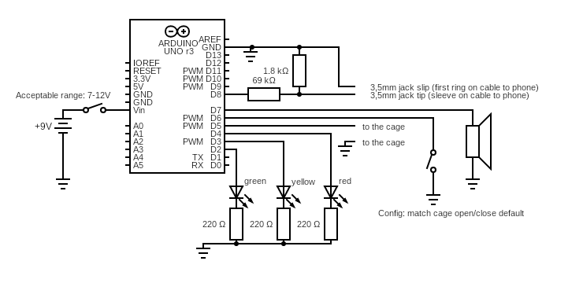

# Start-trigger för whippet race
En låda som triggas av switchen vid start-buren och skickar en ljudsignal till en iPhone/iPad med [Sprint Timer](https://appmaker.se/home/sprinttimer/)

## Hur man använder lådan
Koppla in switchen från start-buren till lådan med banankontakter.
Koppla lådan till telefonen. På Karlstads och Södertäljes lådor är det viktigt att stoppa in ljud-kabeln åt rätt håll.

Om man inte har en antik telefon behöver man en adapter för att få in ljudsladden. Viktigt att den ska fungera med mikrofon. Det är även praktiskt om den kan ta laddning samtidigt. Jag rekommenderar en [Belkin 3,5 mm Audio + Charge Rockstar lightning](https://www.prisjakt.nu/produkt.php?p=5065369). 

Beroende på om switchen på buren är öppen/stängd när buren är öppen/stängd kan man behöva konfigurera lådan. Koppla ur den gula kabeln (finns ej på Södertäljes låda). Behöver du sätta tillbaka den så ska den gå mellan `D6` och `GND`.

Kör SprintTimer på din telefon. Jag har Pro-versionen, men jag tror det räcker med den billigare för 69kr.

Jag brukar ha följande inställningar i SprintTimer.

Viktigt att mikrofonen på startbilden ser ut som på bilden, annars är något felkopplat och SprintTimer använder telefonens vanliga mikrofon istället för sladden från lådan.

 

För säkerhets skull kan det vara bra att byta batteri innan tävlingar. Det behövs 6st AA-batterier.

## Hur man bygger lådan

En brasklapp för ljud-kopplingen till telefonen exakt vilken TRRS-kontakt som kopplas var. 
Det borde vara jord till R2 och mikrofon till Sleeve enligt CTIA, men det stämmer inte med det skrivit i kopplingsschemat. Man får pröva tills det funkar...

[Arduino-kod](start-trigger.ino)

Utöver komponenter jag haft liggandes hemma har jag köpt följande komponenter:
- [Arduino](https://www.electrokit.com/uno-rev3-arduino-kompatibel)
- [Batterihållare](https://www.electrokit.com/batterihallare-6xaa-kabel)
- [Svart banankontakt](https://www.electrokit.com/banankontakt-4mm-hona-chassi-svart)
- [Röd banankontakt](https://www.electrokit.com/banankontakt-4mm-hona-chassi-rod)
- [3,5mm hona](https://www.electrokit.com/3.5mm-jack-2-pol-pcb-med-brytare-pj398sm) men nästa tror jag det är bättre att använda en [4-polig](https://www.electrokit.com/3.5mm-jack-4-pol-chassie) så att man kan använda en standard 4-polig 3,5mm-kabel istället för att sätta ihop sin egen.
- [Högtalare](https://www.electrokit.com/miniatyrhogtalare-8ohm-0.5w-20mm) för status-ljud
- [Matlåda](https://www.ikea.com/se/sv/p/ikea-365-matlada-med-lock-rektangulaer-plast-70507963/)

Se även [Bilder](bilder) på färdigbyggda lådor.